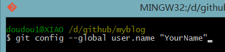
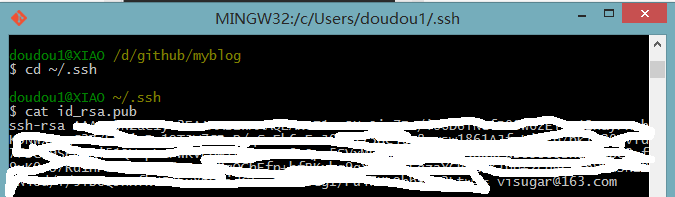

# Windows环境Hexo博客搭建

---

## 安装环境
### 安装Git Bash
* Windows: 下载并安装[Git](https://git-scm.com/download/win).
* Mac: 使用[Homebrew](http://mxcl.github.com/homebrew/), [MacPorts](http://www.macports.org/) ：`brew install git`;或下载 [安装程序](http://sourceforge.net/projects/git-osx-installer/) 安装。
* Linux(Ubuntu, Debian): `sudo apt-get install git-core`
* Linux(Fedora, Red Hat, CentOS): `sudo yum install git-core`

### 安装NodeJs
Hexo是基于nodeJS环境的静态博客.
* [下载地址](https://nodejs.org/en/)(说明：LTS为长期支持版，Current为当前最新版)
* Windows可以采用exe或者下载zip包，添加环境变量的方式安装
```shell
$ node -v
v10.6.0
```

### 安装Hexo
```shell
$ npm i -g hexo
$ hexo -V
hexo: 3.7.1
hexo-cli: 1.1.0
os: Windows_NT 6.1.7601 win32 x64
http_parser: 2.8.0
node: 10.6.0
v8: 6.7.288.46-node.13
uv: 1.21.0
zlib: 1.2.11
ares: 1.14.0
modules: 64
nghttp2: 1.32.0
napi: 3
openssl: 1.1.0h
icu: 61.1
unicode: 10.0
cldr: 33.0
tz: 2018c
```

## 生成Hexo博客
```shell
#创建Blog目录
$ mkdir -p /opt/hexo
$ cd /opt/hexo
#初始化hexo博客
$ hexo init
#安装依赖包
$ npm install
```

新建完成后，指定文件夹的目录如下

* node_modules：是依赖包
* public：存放的是生成的页面
* scaffolds：命令生成文章等的模板
* source：用命令创建的各种文章
* themes：主题
* _config.yml：整个博客的配置
* db.json：source 解析所得到的
* package.json：项目所需模块项目的配置信息
 
## 更换主题
我使用的是屠城版Maupassant主题，它最初是由Cho大神为Typecho平台设计开发的一套响应式模板，体积只有20KB，在各种尺寸的设备上表现出色。由于其简洁大气的风格受到许多用户喜爱，目前也已经被移植到了多个平台上，例如：
* [Typecho](https://github.com/pagecho/maupassant/) 
* [Octopress](https://github.com/pagecho/mewpassant/)
* [Farbox](https://github.com/pagecho/Maupassant-farbox/)
* [Wordpress](https://github.com/iMuFeng/maupassant/)
* [Ghost](https://github.com/LjxPrime/maupassant/)
* [屠城](https://github.com/tufu9441/maupassant-hexo)

### 主题安装
```shell
$ git clone https://github.com/tufu9441/maupassant-hexo.git themes/maupassant
$ npm install hexo-renderer-pug --save
$ npm install hexo-renderer-sass --save
```
编辑Hexo目录下的 `_config.yml`，将 `theme` 的值改为 `maupassant` 和 `language` 的值改为 `zh-CN`。

**注：**若 `npm install hexo-renderer-sass` 安装时报错，可能是国内网络问题，请尝试使用代理或者切换至[淘宝NPM镜像](http://npm.taobao.org/)安装，感谢光头强提供的方法。

### 功能配置
配置文件路径 `themes\maupassant\_config.yml`
```shell
disqus: ## Your disqus_shortname, e.g. username
uyan: ## Your uyan_id. e.g. 1234567
livere: ## Your livere data-uid, e.g. MTAyMC8zMDAxOC78NTgz
changyan: ## Your changyan appid, e.g. cyrALsXc8
changyan_conf: ## Your changyan conf, e.g. prod_d8a508c2825ab57eeb43e7c69bba0e8b
gitment:
  enable: false ## If you want to use Gitment comment system please set the value to true.
  owner: ## Your GitHub ID, e.g. username
  repo: ## The repository to store your comments, make sure you're the repo's owner, e.g. imsun.github.io
  client_id: ## GitHub client ID, e.g. 75752dafe7907a897619
  client_secret: ## GitHub client secret, e.g. ec2fb9054972c891289640354993b662f4cccc50
gitalk:
  enable: false ## If you want to use Gitment comment system please set the value to true.
  owner:  ## Your GitHub ID, e.g. username
  repo:  ## The repository to store your comments, make sure you're the repo's owner, e.g. gitalk.github.io
  client_id:  ## GitHub client ID, e.g. 75752dafe7907a897619
  client_secret:  ## GitHub client secret, e.g. ec2fb9054972c891289640354993b662f4cccc50
  admin:  ## Github repo owner and collaborators, only these guys can initialize github issues.
valine: ## https://valine.js.org
  enable: false ## If you want to use Valine comment system, please set the value to true.
  appid: ## Your LeanCloud application App ID, e.g. pRBBL2JR4N7kLEGojrF0MsSs-gzGzoHsz
  appkey: ## Your LeanCloud application App Key, e.g. tjczHpDfhjYDSYddzymYK1JJ
  notify: false ## Mail notifier, see https://github.com/xCss/Valine/wiki/Valine-评论系统中的邮件提醒设置
  verify: false ## Validation code.
  placeholder: Just so so ## Comment box placeholders.
  avatar: 'mm' ## Gravatar type, see https://github.com/xCss/Valine/wiki/avatar-setting-for-valine
  pageSize: 10 ## Number of comments per page.
  guest_info: nick,mail,link ## Attributes of reviewers.

google_search: false ## Use Google search, true/false.
baidu_search: false ## Use Baidu search, true/false.
swiftype: ## Your swiftype_key, e.g. m7b11ZrsT8Me7gzApciT
tinysou: ## Your tinysou_key, e.g. 4ac092ad8d749fdc6293
self_search: true ## Use a jQuery-based local search engine, true/false.
google_analytics: ## Your Google Analytics tracking id, e.g. UA-42425684-2
baidu_analytics: ## Your Baidu Analytics tracking id, e.g. 8006843039519956000
fancybox: true ## If you want to use fancybox please set the value to true.
show_category_count: true ## If you want to show the count of categories in the sidebar widget please set the value to true.
toc_number: true ## If you want to add list number to toc please set the value to true.
shareto: true ## If you want to use the share button please set the value to true, and you must have hexo-helper-qrcode installed.
busuanzi: false ## If you want to use Busuanzi page views please set the value to true.
wordcount: false ## If you want to display the word counter and the reading time expected to spend of each post please set the value to true, and you must have hexo-wordcount installed.
widgets_on_small_screens: false ## Set to true to enable widgets on small screens.
canvas_nest:
  enable: false ## If you want to use dynamic background please set the value to true, you can also fill the following parameters to customize the dynamic effect, or just leave them blank to keep the default effect.
  color: ## RGB value of the color, e.g. "100,99,98"
  opacity: ## Transparency of lines, e.g. "0.7"
  zIndex: ## The z-index property of the background, e.g. "-1"
  count: ## Quantity of lines, e.g. "150"
donate:
  enable: false ## If you want to display the donate button after each post, please set the value to true and fill the following items on your need. You can also enable donate button in a page by adding a "donate: true" item to the front-matter.
  github: ## GitHub URL, e.g. https://github.com/Kaiyuan/donate-page
  alipay_qr: ## Path of Alipay QRcode image, e.g. /img/AliPayQR.png
  wechat_qr: ## Path of Wechat QRcode image, e.g. /img/WeChatQR.png
  btc_qr: ## Path of Bitcoin QRcode image, e.g. /img/BTCQR.png
  btc_key: ## Bitcoin key, e.g. 1KuK5eK2BLsqpsFVXXSBG5wbSAwZVadt6L
  paypal_url: ## Paypal URL, e.g. https://www.paypal.me/tufu9441
post_copyright:
  enable: false ## If you want to display the copyright info after each post, please set the value to true and fill the following items on your need.
  author: ## Your author name, e.g. tufu9441
  copyright_text: ## Your copyright text, e.g. The author owns the copyright, please indicate the source reproduced.

menu:
  - page: 主页
    directory: .
    icon: fa-home
  - page: 归档
    directory: archives/
    icon: fa-archive
  - page: 关于
    directory: about/
    icon: fa-user
  - page: 任务
    directory: tasks/
    icon: fa-tasks
  - page: rss
    directory: atom.xml
    icon: fa-rss
    
widgets: ## Six widgets in sidebar provided: search, category, tag, recent_posts, rencent_comments and links.
  - search
  - category
  - tag
  - recent_posts
  - recent_comments
  - links

links:
  - title: site-name1
    url: http://BowenZhuangOutlook.github.io
  - title: site-name2
    url: http://BowenZhuangOutlook.github.io
  - title: site-name3
    url: http://BowenZhuangOutlook.github.io

timeline:
  - num: 1
    word: 2014/06/12-Start
  - num: 2
    word: 2014/11/29-XXX
  - num: 3
    word: 2015/02/18-DDD
  - num: 4
    word: More

# Static files
js: js
css: css

# Theme version
version: 0.0.0
```

* fancybox - 是否启用 [Fancybox](http://fancyapps.com/fancybox/) 图片灯箱效果
* disqus - [Disqus评论](https://disqus.com/) shortnam
* uyan - [友言评论](http://www.uyan.cc/) id
* livere - [来必力评论](https://livere.com/) data-uid
* changyan - [畅言评论](http://changyan.kuaizhan.com/) appid
* gitment - [Gitment](https://github.com/imsun/gitment) 评论相关参数
* gitalk - [Gitalk](https://github.com/gitalk/gitalk) 评论相关参数
* valine - [Valine](https://valine.js.org/) 评论相关参数
* google_search - 默认使用Google搜索引擎
* baidu_search - 若想使用百度搜索，将其设定为true。
* swiftype - [Swiftype](https://swiftype.com/) 站内搜索key
* tinysou - [微搜索](http://tinysou.com/) key
* self_search - 基于jQuery的[本地搜索引擎](http://hahack.com/codes/local-search-engine-for-hexo)，需要安装 [hexo-generator-search](https://github.com/PaicHyperionDev/hexo-generator-search) 插件使用。
* google_analytics - Google Analytics 跟踪ID
* baidu_analytics - [百度统计](http://tongji.baidu.com/) 跟踪ID
* show_category_count - 是否显示侧边栏分类数目
* toc_number - 是否显示文章中目录列表自动编号
* shareto - 是否使用分享按鈕，需要安装 [hexo-helper-qrcode](https://github.com/yscoder/hexo-helper-qrcode) 插件使用
* busuanzi - 是否使用不蒜子页面访问计数
* widgets_on_small_screens - 是否在移动设备屏幕底部显示侧边栏
* [canvas_nest](https://github.com/hustcc/canvas-nest.js/blob/master/README-zh.md) - 是否使用canvas动态背景
* donate - 是否启用捐赠按钮
* menu - 自定义页面及菜单，依照已有格式填写。填写后请在 `source` 目录下建立相应名称的文件夹，并包含 `index.md` 文件，以正确显示页面。导航菜单中集成了 [FontAwesome](http://fontawesome.io/) 图标字体，可以在这里选择新的图标，并按照相关说明使用。
* widgets - 选择和排列希望使用的侧边栏小工具。
* links - 友情链接，请依照格式填写。
* timeline - 网站历史时间线，在页面`front-matter`中设置`layout: timeline`可显示。
* Static files - 静态文件存储路径，方便设置CDN缓存。
* Theme version - 主题版本，便于静态文件更新后刷新CDN缓存。

### 主题特性
#### 网站图标
若要设置网站 Favicon，可以将 favicon.ico 放在Hexo根目录的 `source` 文件夹下，建议的大小：32px*32px。

若要为网站添加苹果设备图标，请将命名为apple-touch-icon.png的图片放在同样的位置，建议的大小：114px*114px。

#### 文章摘要
首页默认显示文章摘要而非全文，可以在文章的front-matter中填写一项`description`:来设置你想显示的摘要，或者直接在文章内容中插入<!--more-->以隐藏后面的内容。
若两者都未设置，则自动截取文章第一段作为摘要。

#### 添加页面
在source目录下建立相应名称的文件夹，然后在文件夹中建立index.md文件，并在index.md的front-matter中设置layout为layout: page。若需要单栏页面，就将layout设置为 layout: single-column。

#### 文章目录
在文章的front-matter中添加toc: true即可让该篇文章显示目录。

#### 文章评论
文章和页面的评论功能可以通过在front-matter中设置comments: true或comments: false来进行开启或关闭（默认开启）。

#### 语法高亮
要启用代码高亮，请在Hexo目录的_config.yml中将highlight选项按照如下设置：

```
highlight:
  enable: true
  auto_detect: true
  line_number: true
  tab_replace:
```

#### 数学公式
要启用数学公式支持，请在Hexo目录的_config.yml中添加：
```
mathjax: true
```
并在相应文章的front-matter中添加mathjax: true，例如：
```
title: Test Math
date: 2016-04-05 14:16:00
categories: math
mathjax: true
---
```
数学公式的默认定界符是$$...$$和\\[...\\]（对于块级公式），以及$...$和\\(...\\)（对于行内公式）。
但是，如果你的文章内容中经常出现美元符号“$”, 或者说你想将“$”用作美元符号而非行内公式的定界符，请在Hexo目录的_config.yml中添加：
```
mathjax2: true
```
而不是mathjax: true。 相应地，在需要使用数学公式的文章的front-matter中也添加mathjax2: true。

#### 支持语言
目前支持简体中文（zh-CN），繁体中文（zh-TW），英语（en），法语（fr-FR），德语（de-DE），韩语（ko）和西班牙语（es-ES）。

## 部署项目

### Github创建repository
* 创建一个repo，名称为`yourname.github.io`, 其中yourname是你的github名称，按照这个规则创建才有用哦，如下：

* 回到gitbash中，配置github账户信息（YourName和YourEail都替换成你自己的）：


* 创建SSH
在gitbash中输入：`ssh-keygen -t rsa -C "youremail@example.com"`，生成ssh。然后按下图的方式找到id_rsa.pub文件的内容。

* 将上面获取的ssh放到github中：添加一个 New SSH key ，title随便取，key就填刚刚那一段。


* 在gitbash中验证是否添加成功：ssh -T git@github.com

### 配置Github并本地预览Hexo
* 用编辑器打开你的blog项目，修改_config.yml文件的一些配置(冒号之后都是有一个半角空格的)：
```shell
deploy:
  type: git
  repo: https://github.com/YourgithubName/YourgithubName.github.io.git
  branch: master
```
* 回到gitbash中，进入你的blog目录，分别执行以下命令：
```shell
hexo clean
hexo generate
hexo s -p 8088
```
* 打开浏览器输入: `http://localhost:8088`

### 上传到github
* 安装 `npm install hexo-deployer-git --save`
* 执行命令(建议每次都按照如下步骤部署),注意deploy的过程中要输入你的username及passward:
```shell
hexo clean
hexo generate
hexo deploy
```