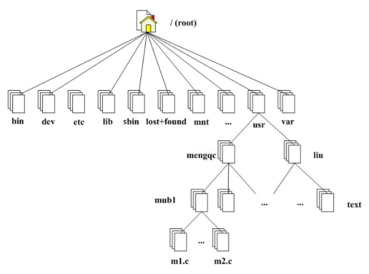

# Linux基础课 

---

## Linux 文件系统

### Linux 文件系统概述

Linux 区别于windows的其中一个很大特点是Linux采用的文件系统结构。
即Linux 只有一个单独的顶级目录结构。所有一切都从'root'开始，用'/'代表，并且延伸到子目录。
`一句话：一切皆文件！当有新的设备要接入Linux，它就把这个设备当作文件目录挂载进来。`
虽然Linux有各种各样不同的发行版本，但他们的文件系统结构大致都是相同的，因此理解了Linux的文件系统结构对学习Linux有非常大的帮助。

### 文件结构

* Linux 文件结构如图所示



`/` 这是Linux的根，所有文件、设备都是在这个根下
`/bin` 这是Linux系统放置很多执行文件的目录，最常见的应该就是`/bin/bash`是放置`shell`命令的
`/dev` 任何设备与接口设备都是以文件形式存放在这个目录中
`/etc` 系统配置文件之类的，比如默认的开机启动项在`/etc/init.d/`下，还有网络`ip`地址设置等等
`/lib` 放置系统开始时需要用到的函数库，可以想象成`windows`中的驱动程序
`/sbin` 这里面放置是的只有`root`用户才能使用的执行文件，就是`super bin`的意思
`/lost+found` 这是在标准的`ext2/ext3`文件系统格式才有的，虽然现在大部分都是`ext4`了，但我觉得很多企业应该还是使用比较老的文件系统格式，毕竟升级还是有一定危险性，所以还是得了解下。就是当系统发生错误的时候，将一些丢失的片段放在里面
`/usr` 特别注意`usr`是`UNIX Software Resource`的缩写，不是`user`，所以里面放的是系统默认的软件，有点像`windows`里的`C:\Windows\`和`C:\Program files\`这两个目录的集合。
`/var` 里面主要是系统缓存、登录文件还有软件运行产生的文件等
`/home` 这是图中没提到的，当你创建一般用户的时候就会在这个目录下新建一个用户目录
`/media` 这里就是放置一些可删除设备，比如`U盘`、`DVD光盘`等


### 相对路径和绝对路径

* 绝对路径
是由根目录`/`开始写起的文件名或目录名称，如 `cd /home/oracle/`

* 相对路径
是以你当前所在路径的相对位置来表示，通常以 `./` 或 `../` 其中
`.`：代表当前的目录
`..`：代表上一层目录，即先返回上一层目录，再找到某某文件夹

## Linux 常用命令

### Linux echo命令(必须掌握)
```
功能说明：显示文字。
语 　 法：echo [-ne][字符串] 或 echo [--help][--version]
补充说明：echo 会将输入的字符串送往标准输出。输出的字符串间以空白字符隔开, 并在最后加上换行号。
参　　 数：-n 不要在最后自动换行
-e 若字符串中出现以下字符，则特别加以处理，而不会将它当成一般
文字输出：
   \a 发出警告声；
   \b 删除前一个字符；
   \c 最后不加上换行符号；
   \f 换行但光标仍旧停留在原来的位置；
   \n 换行且光标移至行首；
   \r 光标移至行首，但不换行；
   \t 插入tab；
   \v 与\f相同；
   \\ 插入\字符；
   \nnn 插入nnn（八进制）所代表的ASCII字符；
–help 显示帮助
–version 显示版本信息
```
**Example**
```
[root@sjtscratedb01etc]#echo "this is echo command test"
this is echo command test
[root@sjtscratedb01etc]#

[root@sjtscratedb01etc]#echo -n "Tecmint is a community of Linux Nerds"
Tecmint is a community of Linux Nerds[root@sjtscratedb01etc]#

[root@sjtscratedb01etc]#echo  "this is echo \n command test"
this is echo \n command test
[root@sjtscratedb01etc]#

[root@sjtscratedb01etc]#echo -e "this is echo \n command test"
this is echo 
 command test
[root@sjtscratedb01etc]#

```

### Linux 环境变量(必须掌握)

#### 设置环境变量

* 暂时性设置环境变量
 
``` 
更改PATH环境变量
export PATH=$PATH:/usr/local/MATLAB/R2013b/bin
```

* 永久性设置环境变量

```
如果想要环境变量永久生效可以修改下面两个文件中的任何一个
1 /etc/profile 
2 ~/.bash_profile
其中，/etc/profile是全局的环境变量，对所有用户生效，而.bash_profile只对当前用户启作用

例如：编辑/etc/profile文件，添加CLASSPATH变量 
# vi /etc/profile 
export CLASSPATH=./$JAVA_HOME/lib;$JAVA_HOME/jre/lib
注：修改文件后要想马上生效还要运行# source /etc/profile不然只能在下次重进此用户时生效

例如：编辑oracle用户目录(/home/oracle)下的.bash_profile 
$ vi /home/oracle/.bash.profile 
添加如下内容： 
export CLASSPATH=./$JAVA_HOME/lib;$JAVA_HOME/jre/lib 
注：修改文件后要想马上生效还要运行$ source /home/oracle/.bash_profile不然只能在下次重进此用户时生效
```

#### 查看环境变量
```
1 使用echo命令查看单个环境变量。例如： 
echo $PATH 
2 使用env查看所有环境变量。例如： 
env 
3 使用set查看所有本地定义的环境变量。
```

#### 使用unset删除指定环境变量
```
set可以设置某个环境变量的值。清除环境变量的值用unset命令。如果未指定值，则该变量值将被设为NULL。示例如下： 
$ export TEST="Test..." #增加一个环境变量TEST 
$ env|grep TEST #此命令有输入，证明环境变量TEST已经存在了 
TEST=Test... 
unset  TEST #删除环境变量TEST 
$ env|grep TEST #此命令没有输出，证明环境变量TEST已经删除
```

#### 常用的环境变量
```
PATH				决定了shell将到哪些目录中寻找命令或程序 
HOME 				当前用户主目录 
HISTSIZE　			历史记录数 
LOGNAME 			当前用户的登录名 
HOSTNAME　			指主机的名称 
SHELL 				当前用户Shell类型 
LANGUGE 　			语言相关的环境变量，多语言可以修改此环境变量 
MAIL　				当前用户的邮件存放目录 
PS1					基本提示符，对于root用户是#，对于普通用户是$
ORACLE_BASE         Oracle数据库基础目录
ORACLE_HOME         Oracle数据库软件的安装目录
ORACLE_SID          Oracle实例名称
ORACLE_UNQNAME      Oralce唯一的数据库名称,跟V$DATABASE.DB_UNIQUE_NAME一致
ORACLE_OWNER        Oracle用户
LD_LIBRARY_PATH     指定查找共享库（动态链接库）时除了默认路径之外的其他路径
CLASSPATH           Java执行环境，在哪些目录下可以找到您所要执行的Java程序所需要的类或者包
NLS_LANG            定义语言,地域以及字符集属性
LANG                设定系统语言
TNS_ADMIN           确定tns管理文件的位置
NLS_DATE_FORMAT     指定用于TO_CHAR和TO_DATE函数的默认日期格式
```


### Linux 目录操作命令
* `cd` 切换到当前目录
* `cd ..` 切换到上一级目录
* `cd -` 跳到上一个目录
* `pwd` 显示当前文件夹的路径
* `ls -la` 显示目录的详细信息
* `ls -lt` 按照时间排序显示目录的详细信息
* `mkdir -p /u01/app/oracle` 递归创建/u01/app/oracle目录
* `mv dir1 /dir2` 将dir文件夹移动到/dir2目录
* `cp -r dir1 /dir2` 将dir文件夹复制到/dir目录
* `rm -r /dir` 删除dir目录
* `du -sh` 查看当前目录每个内容的大小 
* `df -hP` 查看文本挂载情况 
* `tree /tmp` 以树形式显示tmp目录的结构

### Linux 文件操作命令
* `touch test` 创建test文本文档
* `vi test` 编辑test文件
* `cat test` 查看test文档的内容
* `head -10 test` 查看test文档的内容前10行
* `tail -10 test` 查看test文档的内容最后10行
* `more test` 分页显示test文本内容，按空格键显示下一页，按q退出
* `less test` 分页显示test文本内容，按空格键显示下一页，按q退出,按上下键进行上翻和下翻
* `mv test test1` test文件重命名为test1
* `cp test1 test2` 把test1拷贝份test2
* `rm test1` 删除test1文件

### vi操作文件常用方式(需要掌握)

* **查看模式**  
`G(shift+g)`　　 跳到文件尾部  
`gg`　　　　　　  跳到文件首部 
`/`             从文本尾部开始查找某个文本 
`?`             从文本首部开始查找某个文本 
`dd`            删除一行 
`ndd`           删除多行 
`yy`            复制一行 
`nyy`           复制多行 
`p`             粘贴一行或多行 
`u`            撤消上一个操作 


* **冒号模式** 
`:w`            保存 
`:wq`　　　      保存并退出 
`:x`            保存并退出 
`:q!`           不保存退出  
`:wq!`          强制保存并退出  
`:set number`   显示行号

* **编辑模式**： 
`a`             当前字符的后面插入  
`i`             当前位置插入  
`o`             当前行后面追加一个新行后插入  

* **不同模式之间切换`ESC`**


### Linux 用户和组操作(必须掌握)
 
##### 用户和组增、删、改和查 

* `id oracle` 查看用户信息
* `cat /etc/passwd` 查看Linux口令文件
注册名：口令：用户标识号：组标识号：用户名：用户主目录：命令解释程序
* `useradd oracle` 创建用户oracle
* `useradd -u 501 oracle` 创建用户oracle并指定其ID为501
* `useradd -u 501 -g root oracle` 创建用户oracle并指定其ID为501，组为root
* `useradd -h` 查看useradd命令简略帮助
* `man useradd` 查看useradd命令详细帮助
* `usermod -u 502 oracle` 修改用户oracle id信息
* `usermod -g root oracle` 修改用户oracle组信息
* `userdel -r oracle` 删除oracle用户
* `passwd oracle` 修改用户密码
* `cat /etc/group` 查看组信息
组名：口令：组标识号：组内用户列表
* `groupadd -g 501 dba ` 添加组信息
* `groupdel dba` 删除组，如果组下面有用户，要先删除用户
* `groupmod -g 502 dba` 修改组的gid
* `useradd -u 501  -g oinstall -G dba oracle` 给用户添加多个组
* `su - oracle` 切换用户并切换用户的配置文件
* `su oracle` 切换用户但不切换用户配置文件    


##### 权限设置  
```
$ ls -l 
-rwxrw-r‐-1 root root 1213 Feb 2 09:39 abc

- 10个字符确定不同用户能对文件干什么
- 第一个字符代表文件（-）、目录（d），链接（l）
- 其余字符每3个一组（rwx），读（r）、写（w）、执行（x）
- 第一组rwx：文件所有者的权限是读、写和执行
- 第二组rw-：与文件所有者同一组的用户的权限是读、写但不能执行
- 第三组r--：不与文件所有者同组的其他用户的权限是读不能写和执行
也可用数字表示为：r=4，w=2，x=1  因此rwx=4+2+1=7
- 1 表示连接的文件数
- root 表示用户
- root表示用户所在的组
- 1213 表示文件大小（字节）
- Feb 2 09:39 表示最后修改日期
- abc 表示文件名
```

|r  |  w |  x
| - | :-: | -: | 
|4  |  2 | 1 |

|rwx |  r-x|   r-x|
| - | :-: | -: |    
|user|　group| others
|7   |  5   |  5  |
|root | root | others  

* `chown oracle:oinstall /oracle`    修改某个目录权限
* `chown -R oracle:oinstall /oracle`  修改某个目录及其子目录权限
* `ls -ld /oracle`                    查看目录权限
* `chmod -R 777 /oracle`              设置目录为最大权
* `chmod -R 755 /oracle`             修改oracle目录及其子目录权限为755

### Linux 软件的解压缩、安装、yum(需要掌握)

##### 解压缩

* **`*.tar`**  
`tar -xvf a.tar` 解压tar包　　
`tar cvf a.tar a/` 将a打包成a.tar

* **`*.tar.gz`**  
`tar -zxvf a.tar.gz` 解压a.tar.gz包
`tar -zcvf a.tar.gz a` 将a打包成a.tar.gz.a 

* **`*.gz`**  
`gunzip a.gz` 解压a.gz
`gzip -c a > a.gz` 将a打包成a.gz(不能打包目录)

* **`*.bz2`**  
`tar -jxvf a.bz2` 解压 a.bz2
`tar -cjvf a.bz2 a` 将a打包成a.bz2

* **`*.zip`**  
`unzip a.zip` 解压a.zip


##### rpm安装命令
* `rpm -ivh file.rpm`  安装软件
* `rpm -qa|grep zsh`  过滤安装好的带有zsh字符的软件
* `rpm -e file.el5`  卸载软件
* `rpm -ga`  查看所以已安装软件 

##### yum安装命令
1. yum源配置 
```
vbox->storage->controller 将iso镜像挂载在linux下 
lsblk 查看ios镜像挂载信息
mkdir -p /mnt/cdrom 创建目录用于挂载iso镜像
mount -t iso9660 /dev/cdrom1 /mnt/cdrom/ 挂载 

 ***可通过编辑/etc/fstab文件来时iso镜像启动挂载*** 
vi /etc/fstab 
/dev/sr1 /mnt/cdrom iso9660 defaults 0 2 在文件末尾添加该行
移除备份共有yum配置
mv /etc/yum.repos.d/public-yum-ol6.repo /etc/yum.repos.d/public-yum-ol6.repo.bak
配置yum仓库
cat > /etc/yum.repos.d/base.repo <<EXX
[server]
name=server
baseurl=file:/mnt/cdrom
gpgcheck=0
enabled=1
EXX 
```

2. 刷新yum配置源
`yum clean all`

3. 使用yum安装软件 
`yum -y install --skip-broken   binutils*` 


### 2.7 Linux 主机名、网络配置、网络查看(需要掌握)

1. 设置网卡向导 
```
Name                 eth0
Device               eth0
Use DHCP             []
Static IP            192.168.56.101
Netmask              255.255.255.0
Default gateway IP   192.168.56.1
```

2. 手动修改网络配置文件 
```
vi /etc/sysconfig/network-scripts/ifcfg-eth0 
DEVICE=eth0 
HWADDR=08:00:27:D8:56:2E
TYPE=Ethernet
UUID=c63ed6ff-7a83-4b30-85e3-a09bdfd1aaba 
ONBOOT=yes
NM_CONTROLLED=yes
BOOTPROTO=static
IPADDR=192.168.56.101
```

3. 修改主机域名  
```
vi /etc/hosts
127.0.0.1       localhost.localdomain localhost  
::1             localhost6.localdomain6 localhost6  
192.168.56.101 test01
vi /etc/sysconfig/network 
NETWORKING=yes
HOSTNAME=test01 
```

4. 重启网卡 
`/etc/init.d/network restart`  

5. 查看网络配置信息  
```
ifconfig eth0 
ifconfig -a  
ip a  
ip add  
```

6. 立即刷新系统设置 
`su -` 

7. 手工修改域名  
```
hostname test01  
退出终端，重新打开 
```

8. 检查IP是否设置成功 
`ping 192.168.56.101`

9. 检查域名是否设置成功
`ping test01`

10. 查看网络监听
`netstat -lntp | grep 22`

### ssh 基本操作

* `/etc/init.d/sshd restart` ssh重启
* `ssh 192.168.56.101`  ssh登录到远程机器
* `scp -r /oracle 192.168.56.101:/tmp` 拷贝文件到远程主机某个目录 


### 管道命令

`echo "this is pipe test" > file.log` 将file.log清空并写入信息 
`echo "this is pipe test" >> file.log` 将信息追加载file.log文件尾部
`grep this *` 搜索当前目录含有this的文件

### Linux 优化的命令

* `ps -ef |grep ora_` 查看进程
* `kill -9 11024` 终止指定进程
* `kill -9 $(ps -ef |grep xxx |grep -v grep |awk '{print $2}')` 批量终止xxx进程
* `fuser -m -u filename` 查找正在使用文件的用户和进程
* `lsof -i :1158` 查询端口是否被占用
* `lsof -i tcp/udp` 查看tcp或者udp的网络连接
* `lsof -p pid` 查看进程
* `lsof -c command` 列出某个命令的进程
* `lsof -u oracle`  列出用户关联的进程
* `lsof filename` 列出某个文件的进程
* `dos2unix file`  windows的文件拷贝到linux上时要转字符集
* `find . -name "keyword"` 查找具体的文件名
* `watch -n 3 "ls /root"` 每隔3秒执行一个命令
* `xhost +` 放开图形界面的限制
* `df -h` 查看磁盘空间
* `free -m ` 查看内存
* `vmstat 1 5` 查看系统统计信息（包括cpu,mem,io等）
* `top`命令 
`s` 调整刷新频率，如改成1，即每秒刷新一次 
`shift + P` 按CPU排序
`shift + M` 按内存排序
`shift + T` 按时间排序
`shift + U` 按用户过滤

### Linux 磁盘管理

* `fdisk -l` 查看各个分区的信息
* `fdisk /dev/sda` 进入分区模式
* `partprobe` 让分区操作立即生效
* `mkfs.ext3 /dev/sda5` 格式化某个分区
* `mount /dev/sda5 /mnt` 把分区mount到某个目录才能使用分区
* `umount /dev/sda5` 取消分区的mount操作
* `cd /etc/udev/rules.d` 把分区映射到某个裸设备, 并增加dba权限
 