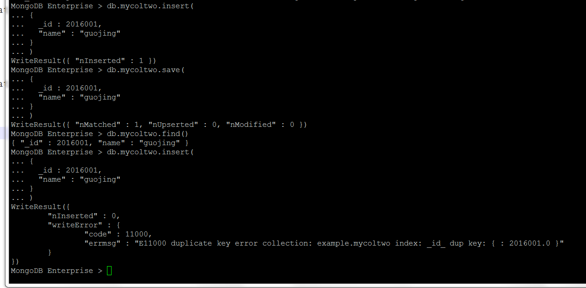
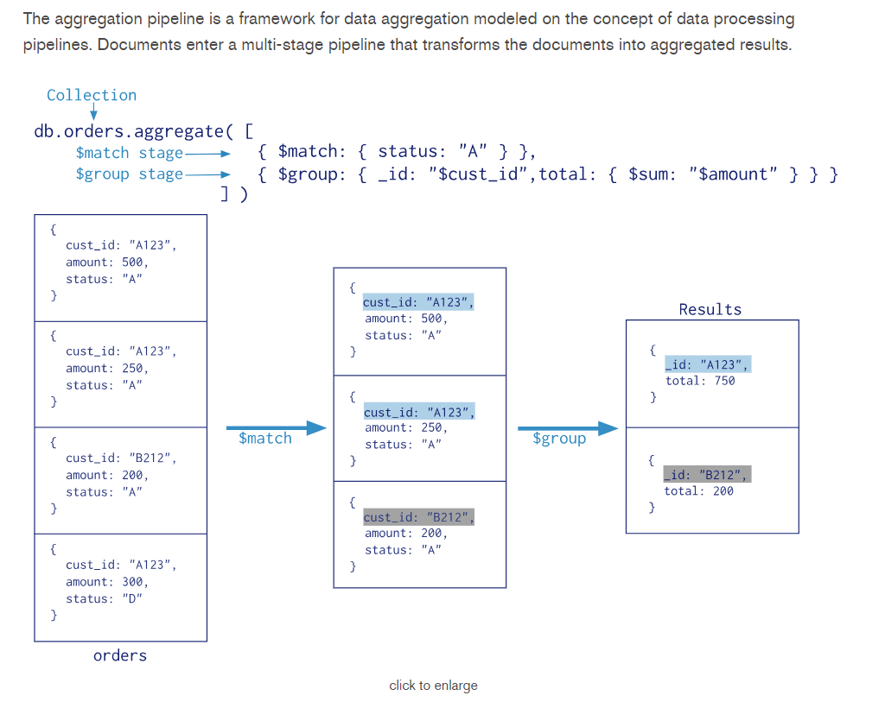

# MOGNODB基本操作

---

## 1. MONGODB自带SHELL客户端

````
## 切换到mongo账号
[root@tst01 ~]# su - mongod
## 进入mongod shell客户端  
tst01 mongod>mongo
MongoDB shell version v3.4.10
connecting to: mongodb://127.0.0.1:27017
MongoDB server version: 3.4.10
Server has startup warnings:
2018-06-02T09:51:06.712+0800 I STORAGE  [initandlisten]
2018-06-02T09:51:06.712+0800 I STORAGE  [initandlisten] ** WARNING: Using the XFS filesystem is strongly recommended with the WiredTiger storage engine
2018-06-02T09:51:06.712+0800 I STORAGE  [initandlisten] **          See http://dochub.mongodb.org/core/prodnotes-filesystem
2018-06-02T09:51:06.987+0800 I CONTROL  [initandlisten]
2018-06-02T09:51:06.987+0800 I CONTROL  [initandlisten] ** WARNING: Access control is not enabled for the database.
2018-06-02T09:51:06.987+0800 I CONTROL  [initandlisten] **          Read and write access to data and configuration is unrestricted.
2018-06-02T09:51:06.987+0800 I CONTROL  [initandlisten]
2018-06-02T09:51:06.987+0800 I CONTROL  [initandlisten]
2018-06-02T09:51:06.987+0800 I CONTROL  [initandlisten] ** WARNING: soft rlimits too low. rlimits set to 1024 processes, 64000 files. Number of processes should be at                       least 32000 : 0.5 times number of files.
## 显示当前mongod服务器数据库
MongoDB Enterprise > show dbs
admin    0.000GB
foolbar  0.000GB
local    0.000GB
## 查看当前数据库的名称
MongoDB Enterprise > db
test
## 显示当前数据库的所有集合
MongoDB Enterprise > show collections
## 切换到foolbar数据库,如果foolbar数据库不存在,会在该数据第一次插入之后创建
MongoDB Enterprise > use foolbar
switched to db foolbar
##  显示当前数据库中有哪些集合,起初应该是为NULL，但我们在创建mongod服务器时，有测试连接型的时候创建个集合,因此能看到blog集合
MongoDB Enterprise > show collections
blog
## 入数据会创建数据库(集合) 插入的数据是一个文档  
MongoDB Enterprise > db.blog.insert({"title":"mongodb shell client"});
WriteResult({ "nInserted" : 1 })
## 查找当前数据库中blog集合的所有文档
MongoDB Enterprise > db.blog.find()
{ "_id" : ObjectId("5b12664097b43b383a56e0c6"), "title1" : "instrduce of mongo" }
{ "_id" : ObjectId("5b12c804c4dbabca2ce3b2a8"), "title" : "mongodb shell client" }
MongoDB Enterprise > db.blog.insert({"docment":"welcome to use mongodb shell client"})
WriteResult({ "nInserted" : 1 })
MongoDB Enterprise > db.blog.find()
{ "_id" : ObjectId("5b12664097b43b383a56e0c6"), "title1" : "instrduce of mongo" }
{ "_id" : ObjectId("5b12c804c4dbabca2ce3b2a8"), "title" : "mongodb shell client" }
{ "_id" : ObjectId("5b12c838c4dbabca2ce3b2a9"), "docment" : "welcome to use mongodb shell client" }
MongoDB Enterprise > db.blog.insert({"title":"my test","name":"pc"})
WriteResult({ "nInserted" : 1 })
MongoDB Enterprise > db.blog.insert({"title":"my test","name":"pc"})
WriteResult({ "nInserted" : 1 })
MongoDB Enterprise > db.blog.insert({"name":"bowenz"})
WriteResult({ "nInserted" : 1 })
MongoDB Enterprise > db.blog.insert({"name":"bowenz"})
WriteResult({ "nInserted" : 1 })
MongoDB Enterprise > db.blog.find()
{ "_id" : ObjectId("5b12664097b43b383a56e0c6"), "title1" : "instrduce of mongo" }
{ "_id" : ObjectId("5b12c804c4dbabca2ce3b2a8"), "title" : "mongodb shell client" }
{ "_id" : ObjectId("5b12c838c4dbabca2ce3b2a9"), "docment" : "welcome to use mongodb shell client" }
{ "_id" : ObjectId("5b12c86dc4dbabca2ce3b2aa"), "title" : "my test", "name" : "pc" }
{ "_id" : ObjectId("5b12c873c4dbabca2ce3b2ab"), "title" : "my test", "name" : "pc" }
{ "_id" : ObjectId("5b12c888c4dbabca2ce3b2ac"), "name" : "bowenz" }
{ "_id" : ObjectId("5b12c88bc4dbabca2ce3b2ad"), "name" : "bowenz" }
## 从当前数据库中的blog集合中移除_id为ObjectId("5b12c86dc4dbabca2ce3b2aa")的文档
MongoDB Enterprise > db.blog.remove({_id:ObjectId("5b12c86dc4dbabca2ce3b2aa")})
WriteResult({ "nRemoved" : 1 })
MongoDB Enterprise > db.blog.find()
{ "_id" : ObjectId("5b12664097b43b383a56e0c6"), "title1" : "instrduce of mongo" }
{ "_id" : ObjectId("5b12c804c4dbabca2ce3b2a8"), "title" : "mongodb shell client" }
{ "_id" : ObjectId("5b12c838c4dbabca2ce3b2a9"), "docment" : "welcome to use mongodb shell client" }
{ "_id" : ObjectId("5b12c873c4dbabca2ce3b2ab"), "title" : "my test", "name" : "pc" }
{ "_id" : ObjectId("5b12c888c4dbabca2ce3b2ac"), "name" : "bowenz" }
{ "_id" : ObjectId("5b12c88bc4dbabca2ce3b2ad"), "name" : "bowenz" }
MongoDB Enterprise > show collections
blog
## 在当前数据库创建一个指定名称的集合
MongoDB Enterprise > db.createCollection("course")
{ "ok" : 1 }
MongoDB Enterprise > show collections
blog
course
## 这个shell函数findOne会返回一个文档 而find函数会返回最多二十个文档.更多区别我们在后面详细介绍
MongoDB Enterprise > db.blog.findOne()
{
        "_id" : ObjectId("5b12664097b43b383a56e0c6"),
        "title1" : "instrduce of mongo"
}
## 统计集合blog所有文档数量
MongoDB Enterprise > db.blog.count()
6
## 退出mongo客户端
MongoDB Enterprise > exit
bye
tst01 mongod>
````

## 2. 创建/删除数据库
1.创建数据库语法
如果数据库不存在，则指向数据库，但不创建（等待实际数据入库时创建），否则切换到指定数据库。
```
use DATABASE_NAME
```
实例
```
MongoDB Enterprise > use webdb
switched to db webdb
MongoDB Enterprise > db
webdb
MongoDB Enterprise > show dbs
admin    0.000GB
foolbar  0.000GB
local    0.000GB
MongoDB Enterprise > show collections
MongoDB Enterprise > db.kemu.insert({"name":"python"})
WriteResult({ "nInserted" : 1 })
MongoDB Enterprise > db.kemu.insert({"name":"java"})
WriteResult({ "nInserted" : 1 })
MongoDB Enterprise > show collections
kemu
MongoDB Enterprise >
```
2.删除数据库语法
删除当前数据库，默认为 test，你可以使用 db 命令查看当前数据库名。
```
db.dropDatabase()
```
实例
```
MongoDB Enterprise > show dbs
admin    0.000GB
foolbar  0.000GB
local    0.000GB
webdb    0.000GB
MongoDB Enterprise > use webdb
switched to db webdb
MongoDB Enterprise > db.dropDatabase()
{ "dropped" : "webdb", "ok" : 1 }
MongoDB Enterprise > show dbs
admin    0.000GB
foolbar  0.000GB
local    0.000GB
MongoDB Enterprise >
```

## 3. 创建/删除集合
1.创建集合语法
```
db.createCollection(name, options)
```
在命令中, name 是要创建的集合的名称. Options 是一个文档，用于指定配置的集合

|参数|类型|描述|
| - | :-:|
|Name|String|要创建的集合名称|
|Options|Document|（可选）指定有关内存大小和索引选项|

选项​​参数是可选的，所以只需要到指定的集合名称。以下是可以使用的选项列表：

|字段|类型|描述|
| - | :-:|
|capped|Boolean|（可选）如果为true，则启用封顶集合。封顶集合是固定大小的集合，当它达到其最大大小，会自动覆盖最早的条目。如果指定true，则需要也指定size字段。|
|autoIndexID|Boolean|（可选）如果为true，自动创建索引_id字段, 默认值是false。(对于副本集，不要将AutoReXixID设置为false)|
|size|number|（可选）指定集合最大可使用字节。如果封顶是 true，那么你还需要指定这个字段。|
|max|number|（可选）指定封顶集合允许在文件的最大数量。Size限制优先于此限制。如果一个封顶集合达到大小size限制，未达到文件的最大数量，MongoDB删除旧的文件。如果您更喜欢使用max，确保为上限的集合所需的大小限制，足以包含文档的最大数量|

当插入文档，MongoDB 第一检查大小字段封顶集合，然后它会检查最大的字段。

实例
```
MongoDB Enterprise > show dbs
admin    0.000GB
foolbar  0.000GB
local    0.000GB
MongoDB Enterprise > use example
switched to db example
MongoDB Enterprise > db.createCollection("mycollection")
{ "ok" : 1 }
MongoDB Enterprise > show collections
mycollection
MongoDB Enterprise > db.createCollection("log",{capped:true,size:1024,max:2})
{ "ok" : 1 }
MongoDB Enterprise > show collections
log
mycollection
MongoDB Enterprise > db.log.insert({"info":"message one"})
WriteResult({ "nInserted" : 1 })
MongoDB Enterprise > db.log.insert({"info":"message two"})
WriteResult({ "nInserted" : 1 })
MongoDB Enterprise > db.log.find()
{ "_id" : ObjectId("5b12d1471f0853ff9e2fe048"), "info" : "message one" }
{ "_id" : ObjectId("5b12d14a1f0853ff9e2fe049"), "info" : "message two" }
MongoDB Enterprise > db.log.insert({"info":"message three"})
WriteResult({ "nInserted" : 1 })
## 请注意观察这个值和上面值有何问题
MongoDB Enterprise > db.log.find()
{ "_id" : ObjectId("5b12d14a1f0853ff9e2fe049"), "info" : "message two" }
{ "_id" : ObjectId("5b12d1581f0853ff9e2fe04a"), "info" : "message three" }
## 在MongoDB中，可以不需要创建集合。当插入一些文档自动创建的集合
MongoDB Enterprise > db.sessionInfo.insert({"ip":"192.1.1.1","name":"D98"})
WriteResult({ "nInserted" : 1 })
MongoDB Enterprise > db.sessionInfo.insert({"ip":"192.1.1.2","name":"L98"})
WriteResult({ "nInserted" : 1 })
MongoDB Enterprise > show collections
log
mycollection
sessionInfo
MongoDB Enterprise > db.sessionInfo.find()
{ "_id" : ObjectId("5b12d18d1f0853ff9e2fe04b"), "ip" : "192.1.1.1", "name" : "D98" }
{ "_id" : ObjectId("5b12d1921f0853ff9e2fe04c"), "ip" : "192.1.1.2", "name" : "L98" }
MongoDB Enterprise >
```

2.删除集合语法
```
db.COLLECTION_NAME.drop()
```
实例
```
MongoDB Enterprise > show dbs
admin    0.000GB
example  0.000GB
foolbar  0.000GB
local    0.000GB
MongoDB Enterprise > use example
switched to db example
MongoDB Enterprise > db.getCollectionNames()
[ "log", "mycollection", "sessionInfo" ]
MongoDB Enterprise > db.log.drop()
true
MongoDB Enterprise > db.getCollectionNames()
[ "mycollection", "sessionInfo" ]
MongoDB Enterprise >
```

## 4. 数据类型
下表为MongoDB中常用的几种数据类型。
* String : 这是最常用的数据类型来存储数据。在MongoDB中的字符串必须是有效的UTF-8
* Integer : 这种类型是用来存储一个数值。整数可以是32位或64位，这取决于您的服务器
* Boolean : 此类型用于存储一个布尔值 (true/ false)
* Double : 这种类型是用来存储浮点值
* Min/ Max keys : 这种类型被用来对BSON元素的最低和最高值比较
* Arrays : 使用此类型的数组或列表或多个值存储到一个键
* Timestamp : 时间戳。这可以方便记录时的文件已被修改或添加
* Object : 此数据类型用于嵌入式的文件
* Null : 这种类型是用来存储一个Null值
* Symbol : 此数据类型用于字符串相同，但它通常是保留给特定符号类型的语言使用
* Date : 此数据类型用于存储当前日期或时间的UNIX时间格式。可以指定自己的日期和时间，日期和年，月，日到创建对象
* Object ID : 此数据类型用于存储文档的ID
* Binary data : 此数据类型用于存储二进制数据
* Code : 此数据类型用于存储到文档中的JavaScript代码
* Regular expression : 此数据类型用于存储正则表达式

## 5. 插入文档
要插入数据到 MongoDB 集合，需要使用 MongoDB 的 insert() 或 save() 方法。
对应的语法分别如下：
```
db.COLLECTION_NAME.insert(document)
db.COLLECTION_NAME.save(document)
```

实例
```
use example
## 插入文档
db.mycol.insert(
  {
     title: 'MongoDB Overview', 
     description: 'MongoDB is no sql database',
     by: 'tutorials itcast',
     url: 'http://www.itcast.cn',
     tags: ['mongodb', 'database', 'NoSQL'],
     likes: 100
  }
)

db.mycol.insert(
  {
     title: 'MySQL Overview', 
     description: 'MySQL is sql database',
     by: 'tutorials itcast',
     url: 'http://www.itcast.cn',
     tags: ['MySQL', 'database', 'SQL'],
     likes: 40
  }
)

## 查看并美化显示结果
db.mycol.find().pretty()

## 要插入单个查询的多个文档，可以传递一个数组 insert() 命令的文件
db.mycol.insert(
[
  {
     title: 'sqlserver', 
     description: 'sqlserver is sql database',
     by: 'tutorials itcast',
     url: 'http://www.itcast.cn',
     tags: ['sqlserver', 'database', 'SQL'],
     likes: 40
  },
  {
     title: 'oracle', 
     description: 'oracle is sql database',
     by: 'tutorials itcast',
     url: 'http://www.itcast.cn',
     tags: ['oracle', 'database', 'SQL'],
     likes: 40
  }
]
)
```

insert() 或 save()区别
1.插入的文档的无_id
save() 方法等同于insert()方法
```
db.mycolone.insert(
  {
     title: 'mongod', 
     description: 'mongod is nosql database',
  }
)
db.mycolone.save(
  {
     title: 'mongod', 
     description: 'mongod is nosql database',
  }
)
```
2.插入的文档的带有"_id"
如果想插入的数据对象已存在数据集合中,
insert函数会报错,提示`E11000 duplicate key error collection`
save函数是覆盖原来的对象
```
db.mycoltwo.insert(
{
  _id : 2016001, 
  "name" : "guojing"
}
)
db.mycoltwo.save(
{
  _id : 2016001, 
  "name" : "guojing"
}
)
db.mycoltwo.insert(
{
  _id : 2016001, 
  "name" : "guojing"
}
```


## 6. 查询文档

### 6.1 基础查询语法
基本的find()方法语法如下
```
db.collection.find(query, projection)
```
* query ：可选，使用查询操作符指定查询条件
* projection ：可选，使用投影操作符指定返回的键。查询时返回文档中所有键值， 只需省略该参数即可（默认省略）

如果你需要以易读的方式来读取数据，可以使用 pretty() 方法，语法格式如下：
```
db.collection.find().pretty()
```
实例
```
MongoDB Enterprise > db.mycol.find()
{ "_id" : ObjectId("5b12d4461f0853ff9e2fe04d"), "title" : "New MongoDB Tutorial", "description" : "MongoDB is no sql database", "by" : "bowenz", "url" : "http://www.itcast.cn", "tags" : [ "mongodb", "database", "NoSQL" ], "likes" : 100 }
{ "_id" : ObjectId("5b12d44c1f0853ff9e2fe04e"), "title" : "MySQL Overview", "description" : "MySQL is sql database", "by" : "lt50", "url" : "http://www.itcast.cn", "tags" : [ "MySQL", "database", "SQL" ], "likes" : 40 }
{ "_id" : ObjectId("5b12d4821f0853ff9e2fe04f"), "title" : "sqlserver", "description" : "sqlserver is sql database", "by" : "lt50", "url" : "http://www.itcast.cn", "tags" : [ "sqlserver", "database", "SQL" ], "likes" : 40 }
{ "_id" : ObjectId("5b12d4821f0853ff9e2fe050"), "title" : "oracle", "description" : "oracle is sql database", "by" : "lt50", "url" : "http://www.itcast.cn", "tags" : [ "oracle", "database", "SQL" ], "likes" : 40 }
MongoDB Enterprise > db.mycol.find().pretty()
{
        "_id" : ObjectId("5b12d4461f0853ff9e2fe04d"),
        "title" : "New MongoDB Tutorial",
        "description" : "MongoDB is no sql database",
        "by" : "bowenz",
        "url" : "http://www.itcast.cn",
        "tags" : [
                "mongodb",
                "database",
                "NoSQL"
        ],
        "likes" : 100
}
{
        "_id" : ObjectId("5b12d44c1f0853ff9e2fe04e"),
        "title" : "MySQL Overview",
        "description" : "MySQL is sql database",
        "by" : "lt50",
        "url" : "http://www.itcast.cn",
        "tags" : [
                "MySQL",
                "database",
                "SQL"
        ],
        "likes" : 40
}
{
        "_id" : ObjectId("5b12d4821f0853ff9e2fe04f"),
        "title" : "sqlserver",
        "description" : "sqlserver is sql database",
        "by" : "lt50",
        "url" : "http://www.itcast.cn",
        "tags" : [
                "sqlserver",
                "database",
                "SQL"
        ],
        "likes" : 40
}
{
        "_id" : ObjectId("5b12d4821f0853ff9e2fe050"),
        "title" : "oracle",
        "description" : "oracle is sql database",
        "by" : "lt50",
        "url" : "http://www.itcast.cn",
        "tags" : [
                "oracle",
                "database",
                "SQL"
        ],
        "likes" : 40
}
MongoDB Enterprise >
```
除了find() 方法外，还有一个 findOne() 法，返回一个结果 ,大家可以实战下。

**MongoDB 与 RDBMS Where 语句比较**

|操作|语法|例子|RDBMS 等同|
| - | :-:|
|等于| `{<key>:<value>}` | db.mycol.find({"by":"tutorials itcast"}).pretty()|where by = 'tutorials itcast'|
|小于| `{<key>:{$lt:<value>}}` |db.mycol.find({"likes":{$lt:50}}).pretty()|where likes < 50|
|小于或等于| `{<key>:{$lte:<value>}}` |db.mycol.find({"likes":{$lte:50}}).pretty()|where likes <= 50|
|大于| `{<key>:{$gt:<value>}}` |db.mycol.find({"likes":{$gt:50}}).pretty()|where likes > 50|
|大于或等于| `{<key>:{$gte:<value>}}` |db.mycol.find({"likes":{$gte:50}}).pretty()|where likes >= 50|
|不等于| `{<key>:{$ne:<value>}}` |db.mycol.find({"likes":{$ne:50}}).pretty()|where likes != 50|

**AND 在MongoDB中用法**
MongoDB 的 find() 方法可以传入多个键(key)，每个键(key)以逗号隔开，即常规 SQL 的 AND 条件。
语法格式如下：
```
db.col.find({key1:value1, key2:value2}).pretty()
```
实例
```
MongoDB Enterprise > db.mycol.find({"title":"oracle","by":"lt50"})
{ "_id" : ObjectId("5b12d4821f0853ff9e2fe050"), "title" : "oracle", "description" : "oracle is sql database", "by" : "lt50", "url" : "http://www.itcast.cn", "tags" : [ "oracle", "database", "SQL" ], "likes" : 40 }
```
**MongoDB中OR**
MongoDB OR 条件语句使用了关键字 $or,语法格式如下：
```
db.col.find({$or: [{key1: value1}, {key2:value2}]}).pretty()
```
实例
```
MongoDB Enterprise > db.mycol.find({$or:[{"title":"oracle"},{"title":"New MongoDB Tutorial"}]})
{ "_id" : ObjectId("5b12d4461f0853ff9e2fe04d"), "title" : "New MongoDB Tutorial", "description" : "MongoDB is no sql database", "by" : "bowenz", "url" : "http://www.itcast.cn", "tags" : [ "mongodb", "database", "NoSQL" ], "likes" : 100 }
{ "_id" : ObjectId("5b12d4821f0853ff9e2fe050"), "title" : "oracle", "description" : "oracle is sql database", "by" : "lt50", "url" : "http://www.itcast.cn", "tags" : [ "oracle", "database", "SQL" ], "likes" : 40 }
```
**AND 和 OR 一起使用**
实例
```
MongoDB Enterprise > db.mycol.find({"by":"lt50",$or:[{"title":"oracle"},{"title":"sqlserver"}]})
{ "_id" : ObjectId("5b12d4821f0853ff9e2fe04f"), "title" : "sqlserver", "description" : "sqlserver is sql database", "by" : "lt50", "url" : "http://www.itcast.cn", "tags" : [ "sqlserver", "database", "SQL" ], "likes" : 40 }
{ "_id" : ObjectId("5b12d4821f0853ff9e2fe050"), "title" : "oracle", "description" : "oracle is sql database", "by" : "lt50", "url" : "http://www.itcast.cn", "tags" : [ "oracle", "database", "SQL" ], "likes" : 40 }
```

**projection 参数的使用方法**
实例
```
MongoDB Enterprise > db.mycol.find({"by":"lt50"},{"title":1,"by":1})
{ "_id" : ObjectId("5b12d44c1f0853ff9e2fe04e"), "title" : "MySQL Overview", "by" : "lt50" }
{ "_id" : ObjectId("5b12d4821f0853ff9e2fe04f"), "title" : "sqlserver", "by" : "lt50" }
{ "_id" : ObjectId("5b12d4821f0853ff9e2fe050"), "title" : "oracle", "by" : "lt50" }
```

### 6.2 Limit和Skip
如果你需要在MongoDB中读取指定数量的数据记录，可以使用MongoDB的Limit方法，limit()方法接受一个数字参数，该参数指定从MongoDB中读取的记录条数。
limit()方法基本语法如下所示：
```
db.col.find().limit(NUMBER)
```
实例
```
MongoDB Enterprise > db.mycol.find().limit(2)
{ "_id" : ObjectId("5b12d4461f0853ff9e2fe04d"), "title" : "New MongoDB Tutorial", "description" : "MongoDB is no sql database", "by" : "bowenz", "url" : "http://www.itcast.cn", "tags" : [ "mongodb", "database", "NoSQL" ], "likes" : 100 }
{ "_id" : ObjectId("5b12d44c1f0853ff9e2fe04e"), "title" : "MySQL Overview", "description" : "MySQL is sql database", "by" : "lt50", "url" : "http://www.itcast.cn", "tags" : [ "MySQL", "database", "SQL" ], "likes" : 40 }
```

我们除了可以使用limit()方法来读取指定数量的数据外，还可以使用skip()方法来跳过指定数量的数据，skip方法同样接受一个数字参数作为跳过的记录条数
```
db.col.find().limit(NUMBER).skip(NUMBER)
```
实例
```
MongoDB Enterprise > db.mycol.find().skip(2).limit(1)
{ "_id" : ObjectId("5b12d4821f0853ff9e2fe04f"), "title" : "sqlserver", "description" : "sqlserver is sql database", "by" : "lt50", "url" : "http://www.itcast.cn", "tags" : [ "sqlserver", "database", "SQL" ], "likes" : 40 }
```

### 6.3 MONGODB排序/distinct

在MongoDB中使用使用sort()方法对数据进行排序，sort()方法可以通过参数指定排序的字段，并使用 1 和 -1 来指定排序的方式，其中 1 为升序排列，而-1是用于降序排列。
sort()方法基本语法如下所示：
```
db.col.find().sort({KEY:1})
```
实例
```
MongoDB Enterprise > db.mycol.find({},{"title":1,"likes":1}).sort({"likes":1})
{ "_id" : ObjectId("5b12d44c1f0853ff9e2fe04e"), "title" : "MySQL Overview", "likes" : 40 }
{ "_id" : ObjectId("5b12d4821f0853ff9e2fe04f"), "title" : "sqlserver", "likes" : 40 }
{ "_id" : ObjectId("5b12d4821f0853ff9e2fe050"), "title" : "oracle", "likes" : 40 }
{ "_id" : ObjectId("5b12d4461f0853ff9e2fe04d"), "title" : "New MongoDB Tutorial", "likes" : 100 }
MongoDB Enterprise > db.mycol.find({},{"title":1,"likes":1}).sort({"likes":-1})
{ "_id" : ObjectId("5b12d4461f0853ff9e2fe04d"), "title" : "New MongoDB Tutorial", "likes" : 100 }
{ "_id" : ObjectId("5b12d44c1f0853ff9e2fe04e"), "title" : "MySQL Overview", "likes" : 40 }
{ "_id" : ObjectId("5b12d4821f0853ff9e2fe04f"), "title" : "sqlserver", "likes" : 40 }
{ "_id" : ObjectId("5b12d4821f0853ff9e2fe050"), "title" : "oracle", "likes" : 40 }
```
在MongoDB中使用使用distinct()方法对数据进行去重。
distinct方法基本语法如下所示:
```
db.collection.distinct(field, query)
```
实例
```
MongoDB Enterprise > db.mycol.distinct("likes")
[ 100, 40 ]
MongoDB Enterprise > db.mycol.distinct("by")
[ "bowenz", "lt50" ]
MongoDB Enterprise > db.mycol.distinct("title")
[ "New MongoDB Tutorial", "MySQL Overview", "sqlserver", "oracle" ]
```

### 6.4 MONGODB聚合

#### 6.4.1 aggregate语法
MongoDB中聚合(aggregate)主要用于处理数据(诸如统计平均值,求和等)，并返回计算后的数据结果。有点类似sql语句中的 count(*), sum(), avg()。

aggregate()语法
```
db.COLLECTION_NAME.aggregate(AGGREGATE_OPERATION)
```
```
db.mycol.aggregate(
[
  { 
    $group:{
		_id:"$by",
		num_tutorial:{
			$sum:1
		}
	}
  }
]
)
```
执行上诉语句得到以下结果:
```
{ "_id" : "lt50", "num_tutorial" : 3 }
{ "_id" : "bowenz", "num_tutorial" : 1 }
MongoDB Enterprise >
```
在上面的例子中，我们通过字段by字段对数据进行分组，并计算by字段相同值的总和。
下表展示了一些聚合的表达式:

|表达式|描述|实例|
| - | :-:|
|$sum|计算总和|db.mycol.aggregate([{$group : {_id : "$by", num_tutorial : {$sum : "$likes"}}}])|
|$avg|计算平均值|db.mycol.aggregate([{$group : {_id : "$by", num_tutorial : {$avg : "$likes"}}}])|
|$min|获取集合中所有文档对应值得最小值|db.mycol.aggregate([{$group : {_id : "$by", num_tutorial : {$min : "$likes"}}}])|
|$max|获取集合中所有文档对应值得最大值|db.mycol.aggregate([{$group : {_id : "$by", num_tutorial : {$max : "$likes"}}}])|
|$push|在结果文档中插入值到一个数组中|db.mycol.aggregate([{$group : {_id : "$by", url : {$push: "$url"}}}])|
|$addToSet|在结果文档中插入值到一个数组中，但不创建副本|db.mycol.aggregate([{$group : {_id : "$by", url : {$addToSet : "$url"}}}])|
|$first|根据资源文档的排序获取第一个文档数据|db.mycol.aggregate([{$group : {_id : "$by", first_url : {$first : "$url"}}}])|
|$last|根据资源文档的排序获取最后一个文档数据|db.mycol.aggregate([{$group : {_id : "$by", last_url : {$last : "$url"}}}])|

以下语句的含义呢？
```
db.mycol.aggregate([{$group : {_id : {by:"$by",url:"$url"}, num_tutorial : {$sum : "$likes"}}}])
```

#### 6.4.2 管道

管道在Unix和Linux中一般用于将当前命令的输出结果作为下一个命令的输入。如下：
```
[root@tst01 ~]# ll
total 104
-rw-------. 1 root root  1554 May 30 21:20 anaconda-ks.cfg
drwxr-xr-x. 2 root root  4096 May 30 21:21 Desktop
drwxr-xr-x. 2 root root  4096 May 30 21:21 Documents
drwxr-xr-x. 2 root root  4096 May 30 21:21 Downloads
-rw-r--r--. 1 root root 51788 May 30 21:20 install.log
-rw-r--r--. 1 root root 10033 May 30 21:17 install.log.syslog
drwxr-xr-x. 2 root root  4096 May 30 21:21 Music
drwxr-xr-x. 2 root root  4096 May 30 21:21 Pictures
drwxr-xr-x. 2 root root  4096 May 30 21:21 Public
drwxr-xr-x. 2 root root  4096 May 30 21:21 Templates
drwxr-xr-x. 2 root root  4096 May 30 21:21 Videos
[root@tst01 ~]# ll | grep Des
drwxr-xr-x. 2 root root  4096 May 30 21:21 Desktop
```
MongoDB的聚合管道将MongoDB文档在一个管道处理完毕后将结果传递给下一个管道处理。管道操作是可以重复的。
表达式：处理输入文档并输出。表达式是无状态的，只能用于计算当前聚合管道的文档，不能处理其它的文档。
聚合管道示意图：


相当于Sql语句： 
```
Select cust_id,sum(amount)as total from orders where status= "A" group by cust_id
```
这里我们介绍一下聚合框架中常用的几个操作：
* $project：修改输入文档的结构。可以用来重命名、增加或删除域，也可以用于创建计算结果以及嵌套文档。
* $match：用于过滤数据，只输出符合条件的文档。$match使用MongoDB的标准查询操作。
* $limit：用来限制MongoDB聚合管道返回的文档数。
* $skip：在聚合管道中跳过指定数量的文档，并返回余下的文档。
* $unwind：将文档中的某一个数组类型字段拆分成多条，每条包含数组中的一个值。
* $group：将集合中的文档分组，可用于统计结果。
* $sort：将输入文档排序后输出。
* $lookup :joined集合中的匹配文档。

##### 6.4.2.1 $project
修改输入文档的结构。可以用来重命名、增加或删除字段(域)，也可以用于创建计算结果以及嵌套文档。
思考，现有books集合内容如下：
```
db.books.insert(
[
{
  title: "mongodb course",
  isbn: "0001122223334",
  author: { last: "bowen", first: "zhuang" },
  copies: 5
},
{
  title: "mysql course",
  isbn: "0001122223334",
  author: { last: "bowen", first: "zhuang" },
  copies: 6
}
]
)
```
1. 指定输出字段
```
db.books.aggregate( [ { $project: { title: 1, author: 1 } } ] )
db.books.aggregate( { $project: { _id: 0, title: 1, author: 1 } })
```
2. 输出嵌入式文档中field
```
db.books.aggregate( { $project: { _id: 0, title: 1, "author.last": 1 } })
```
3. 改变输出结构
```
db.books.aggregate( { $project: { _id: 0, title: 1, "lastName": "$author.last" } })
```
4. 计算 Fields
substr 语法： `{ $substr: [ <string>, <start>, <length> ] }`
```
db.books.aggregate( [ { $project: { title: 1, isbn: {
prefix: { $substr: [ "$isbn", 1, 3 ] }, }, 
lastName: "$author.last", copiesSold: "$copies" } } ] )
```


##### 6.4.2.2 $match
用于过滤数据，只输出符合条件的文档。$match使用MongoDB的标准查询操作。
示例
```
db.articles.insert([ { "_id" : 1, "author" : "dave", "score" : 80, "views" : 100 }, 
{ "_id" : 2, "author" : "dave", "score" : 85, "views" : 521 }, 
{ "_id" : 3, "author" : "ahn", "score" : 60, "views" : 1000 }, 
{ "_id" : 4, "author" : "li", "score" : 55, "views" : 5000 },
{ "_id" : 5, "author" : "annT", "score" : 60, "views" : 50 }, 
{ "_id" : 6, "author" : "li", "score" : 94, "views" : 999 }, 
{ "_id" : 7, "author" : "ty", "score" : 95, "views" : 1000 } ])
```
1. Match 匹配
```
db.articles.aggregate([ { $match : { author : "dave" } } ] )
```
2. 范围条件匹配
```
db.articles.aggregate([ { $match: { $or: [ { score: { $gt: 70, $lt: 90 } }, { views: { $gte: 1000 } } ] } } ])
```
3. 计算Count值
```
db.articles.aggregate( [ { $match: { $or: [ { score: { $gt: 70, $lt: 90 } }, 
{ views: { $gte: 1000 } } ] } }, 
{ $group: { _id: null, count: { $sum: 1 } } } ] )
```

##### 6.4.2.3 $group
将集合中的文档分组，可用于统计结果。
示例
```
db.sales.insert([ { "_id" : 1, "item" : "abc", "price" : 10, "quantity" : 2, "date" : ISODate("2014-03-01T08:00:00Z") }, 
{ "_id" : 2, "item" : "jkl", "price" : 20, "quantity" : 1, "date" : ISODate("2014-03-01T09:00:00Z") }, 
{ "_id" : 3, "item" : "xyz", "price" : 5, "quantity" : 10, "date" : ISODate("2014-03-15T09:00:00Z") }, { "_id" : 4, "item" : "xyz", "price" : 5, "quantity" : 20, "date" : ISODate("2014-04-04T11:21:39.736Z") }, 
{ "_id" : 5, "item" : "abc", "price" : 10, "quantity" : 10, "date" : ISODate("2014-04-04T21:23:13.331Z") } ])
```
下面的聚合操作使用 $group 将文档按月、日、年组分组, 计算平均数量以及每个组的文档数：
```
db.sales.aggregate(
   [
      {
        $group : {
           _id : { month: { $month: "$date" }, day: { $dayOfMonth: "$date" }, year: { $year: "$date" } },
           averageQuantity: { $avg: "$quantity" },
           count: { $sum: 1 }
        }
      }
   ]
)
```
下面的聚合操作指定_id 等于null的空组，计算总价格和平均数量以及集合中的所有文件数：
```
db.sales.aggregate(
   [
      {
        $group : {
           _id : null,
           totalPrice: { $sum: { $multiply: [ "$price", "$quantity" ] } },
           averageQuantity: { $avg: "$quantity" },
           count: { $sum: 1 }
        }
      }
   ]
)
```
下面的聚合操作使用 $group 将item字段去重，以检索不同的项目值：
```
db.sales.aggregate( [ { $group : { _id : "$item" } } ] )
```
集合$match,做个复杂的聚合运算
```
db.articles.aggregate(
[
  {$match: {$or: [{views:{$gte:1000}},{score:{$gt:70,$lt:90}}]} },
  {$group: {_id:"$author",sum_score:{$sum: "$score"},avg_views:{$avg:"$views"}}}
]
)
```

##### 6.4.2.4 $unwind
将文档中的某一个数组类型字段拆分成多条，每条包含数组中的一个值
语法
```
{
  $unwind:
    {
      path: <field path>,          #拆分路径
      includeArrayIndex: <string>,   #指定数组索引号
      preserveNullAndEmptyArrays: <boolean>   #防止数据丢失
    }
}
```
示例
```
db.shoes.insert([ { "_id" : 1, "item" : "ABC", "sizes": [ "S", "M", "L"] }, 
{ "_id" : 2, "item" : "EFG", "sizes" : [ ] }, 
{ "_id" : 3, "item" : "IJK", "sizes": "M" },
{ "_id" : 4, "item" : "LMN" },
{ "_id" : 5, "item" : "XYZ", "sizes" : null } ])
```
```
db.shoes.aggregate( [ { $unwind: "$sizes" } ] )
db.shoes.aggregate( [ { $unwind: { path: "$sizes" } } ] )
db.shoes.aggregate( [ { $unwind: { path: "$sizes",preserveNullAndEmptyArrays:true} } ] )
db.shoes.aggregate( [ { $unwind: { path: "$sizes", includeArrayIndex: "arrayIndex" } } ] )
```

##### 6.4.2.4 $lookup
执行左连接到一个集合(unsharded)，必须在同一数据库中
$lookup添加了一个新的数组字段，该字段的元素是joined集合中的匹配文档。

$lookup 语法如下:
```
{
   $lookup:
     {
       from: <collection to join>,   #右集合
       localField: <field from the input documents>,  #左集合 join字段
       foreignField: <field from the documents of the "from" collection>, #右集合 join字段
       as: <output array field>   #新生成字段（类型array）
     }
}
```
|Field|Description|
| - | :-:|
|from|右集合，指定在同一数据库中执行连接的集合。此集合不能shared分片|
|localField|指定左集合（db.collectionname）匹配的字段。如果左集合不包含localField，$lookup 视为null值来匹配|
|foreignField|指定from集合（右集合）用来匹配的字段。如果集合不包含该字段，$lookup 视为null值来匹配|
|as|指定要添加到输入文档的新数组字段的名称。新的数组字段包含from集合中匹配的文档。如果在文档中指定的名称已经存在，现有的领域覆盖|

实例
**使用$lookup集合连接**
左集合 `orders` 内容如下
```
db.orders.insert([ { "_id" : 1, "item" : "abc", "price" : 12, "quantity" : 2 }, 
{ "_id" : 2, "item" : "jkl", "price" : 20, "quantity" : 1 }, 
{ "_id" : 3 } ])
```
另外一个右集合 `products` 内容如下：
```
db.products.insert([ { "_id" : 1, "sku" : "abc", description: "product 1", "instock" : 120 }, 
{ "_id" : 2, "sku" : "def", description: "product 2", "instock" : 80 }, 
{ "_id" : 3, "sku" : "ijk", description: "product 3", "instock" : 60 }, 
{ "_id" : 4, "sku" : "jkl", description: "product 4", "instock" : 70 }, 
{ "_id" : 5, "sku": null, description: "Incomplete" }, { "_id" : 6 } ])
```
以下聚合操作对 `orders`左集合 左连接 `products` 右集合，通过 `orders`下的`item` 与 `products` 集合的`sku`：
值得注意：
* 两个集合必须在同一个db
* orders是左集合，左连接
* item是orders左集合字段
* sku是products右集合字段
* item为null, 左连接, 右集合 sku为null

```
db.orders.aggregate([ { $lookup: { from: "products", localField: "item", foreignField: "sku", as: "product_docs" } } ]).pretty()
```

##### 6.4.2.4 $out
输出到集合
```
db.orders.aggregate([ { $lookup: { from: "products", localField: "item", foreignField: "sku", as: "product_docs" } },
{ $out : "order_details" }
 ])
db.order_details.find()
```

## 7. 更新/删除文档
MongoDB 使用 update() 和 save() 方法来更新集合中的文档。接下来让我们详细来看下两个函数的应用及其区别。
update() 方法的基本语法如下:
```
db.collection.update(
   <query>,
   <update>,
   {
     upsert: <boolean>,
     multi: <boolean>,
     writeConcern: <document>
   }
)
```
参数说明：
* query : update的查询条件，类似sql update查询内where后面的
* update : update的对象和一些更新的操作符（如$,$inc...）等，也可以理解为sql update查询内set后面的
* upsert : 可选，这个参数的意思是，如果不存在update的记录，是否插入objNew，true为插入，默认是false，不插入
* multi : 可选，mongodb 默认是false，只更新找到的第一条记录，如果这个参数为true，就把按条件查出来多条记录全部更新
* writeConcern :可选，抛出异常的级别

实例
考虑用以下数据集合
```
MongoDB Enterprise > use example
switched to db example
MongoDB Enterprise > show collections
mycol
mycollection
mycolone
mycoltwo
sessionInfo
MongoDB Enterprise > db.mycol.find().pretty()
{
        "_id" : ObjectId("5b12d4461f0853ff9e2fe04d"),
        "title" : "MongoDB Overview",
        "description" : "MongoDB is no sql database",
        "by" : "tutorials itcast",
        "url" : "http://www.itcast.cn",
        "tags" : [
                "mongodb",
                "database",
                "NoSQL"
        ],
        "likes" : 100
}
{
        "_id" : ObjectId("5b12d44c1f0853ff9e2fe04e"),
        "title" : "MySQL Overview",
        "description" : "MySQL is sql database",
        "by" : "tutorials itcast",
        "url" : "http://www.itcast.cn",
        "tags" : [
                "MySQL",
                "database",
                "SQL"
        ],
        "likes" : 40
}
{
        "_id" : ObjectId("5b12d4821f0853ff9e2fe04f"),
        "title" : "sqlserver",
        "description" : "sqlserver is sql database",
        "by" : "tutorials itcast",
        "url" : "http://www.itcast.cn",
        "tags" : [
                "sqlserver",
                "database",
                "SQL"
        ],
        "likes" : 40
}
{
        "_id" : ObjectId("5b12d4821f0853ff9e2fe050"),
        "title" : "oracle",
        "description" : "oracle is sql database",
        "by" : "tutorials itcast",
        "url" : "http://www.itcast.cn",
        "tags" : [
                "oracle",
                "database",
                "SQL"
        ],
        "likes" : 40
}
MongoDB Enterprise >
```

下面的例子将设置标题MongoDB Overview的文件，更新其标题是New MongoDB Tutorial
```
MongoDB Enterprise > db.mycol.update({"title":"MongoDB Overview"},{$set:{"title":"New MongoDB Tutorial"}})
WriteResult({ "nMatched" : 1, "nUpserted" : 0, "nModified" : 1 })
MongoDB Enterprise > db.mycol.find()
{ "_id" : ObjectId("5b12d4461f0853ff9e2fe04d"), "title" : "New MongoDB Tutorial", "description" : "MongoDB is no sql database", "by" : "tutorials itcast", "url" : "http://www.itcast.cn", "tags" : [ "mongodb", "database", "NoSQL" ], "likes" : 100 }
{ "_id" : ObjectId("5b12d44c1f0853ff9e2fe04e"), "title" : "MySQL Overview", "description" : "MySQL is sql database", "by" : "tutorials itcast", "url" : "http://www.itcast.cn", "tags" : [ "MySQL", "database", "SQL" ], "likes" : 40 }
{ "_id" : ObjectId("5b12d4821f0853ff9e2fe04f"), "title" : "sqlserver", "description" : "sqlserver is sql database", "by" : "tutorials itcast", "url" : "http://www.itcast.cn", "tags" : [ "sqlserver", "database", "SQL" ], "likes" : 40 }
{ "_id" : ObjectId("5b12d4821f0853ff9e2fe050"), "title" : "oracle", "description" : "oracle is sql database", "by" : "tutorials itcast", "url" : "http://www.itcast.cn", "tags" : [ "oracle", "database", "SQL" ], "likes" : 40 }
```

MongoDB默认将只更新单一的文件，来更新多个你需要设置参数置multi为true
```
MongoDB Enterprise > db.mycol.update({"by":"tutorials itcast"},{$set:{"by":"bowenz"}})
WriteResult({ "nMatched" : 1, "nUpserted" : 0, "nModified" : 1 })
MongoDB Enterprise > db.mycol.find()
{ "_id" : ObjectId("5b12d4461f0853ff9e2fe04d"), "title" : "New MongoDB Tutorial", "description" : "MongoDB is no sql database", "by" : "bowenz", "url" : "http://www.itcast.cn", "tags" : [ "mongodb", "database", "NoSQL" ], "likes" : 100 }
{ "_id" : ObjectId("5b12d44c1f0853ff9e2fe04e"), "title" : "MySQL Overview", "description" : "MySQL is sql database", "by" : "tutorials itcast", "url" : "http://www.itcast.cn", "tags" : [ "MySQL", "database", "SQL" ], "likes" : 40 }
{ "_id" : ObjectId("5b12d4821f0853ff9e2fe04f"), "title" : "sqlserver", "description" : "sqlserver is sql database", "by" : "tutorials itcast", "url" : "http://www.itcast.cn", "tags" : [ "sqlserver", "database", "SQL" ], "likes" : 40 }
{ "_id" : ObjectId("5b12d4821f0853ff9e2fe050"), "title" : "oracle", "description" : "oracle is sql database", "by" : "tutorials itcast", "url" : "http://www.itcast.cn", "tags" : [ "oracle", "database", "SQL" ], "likes" : 40 }
MongoDB Enterprise > db.mycol.update({"by":"tutorials itcast"},{$set:{"by":"bowenz"}},{multi:true})
WriteResult({ "nMatched" : 3, "nUpserted" : 0, "nModified" : 3 })
MongoDB Enterprise > db.mycol.find()
{ "_id" : ObjectId("5b12d4461f0853ff9e2fe04d"), "title" : "New MongoDB Tutorial", "description" : "MongoDB is no sql database", "by" : "bowenz", "url" : "http://www.itcast.cn", "tags" : [ "mongodb", "database", "NoSQL" ], "likes" : 100 }
{ "_id" : ObjectId("5b12d44c1f0853ff9e2fe04e"), "title" : "MySQL Overview", "description" : "MySQL is sql database", "by" : "bowenz", "url" : "http://www.itcast.cn", "tags" : [ "MySQL", "database", "SQL" ], "likes" : 40 }
{ "_id" : ObjectId("5b12d4821f0853ff9e2fe04f"), "title" : "sqlserver", "description" : "sqlserver is sql database", "by" : "bowenz", "url" : "http://www.itcast.cn", "tags" : [ "sqlserver", "database", "SQL" ], "likes" : 40 }
{ "_id" : ObjectId("5b12d4821f0853ff9e2fe050"), "title" : "oracle", "description" : "oracle is sql database", "by" : "bowenz", "url" : "http://www.itcast.cn", "tags" : [ "oracle", "database", "SQL" ], "likes" : 40 }

```
save() 方法覆盖原有的文档 或者 插入新的文档，我们在`插入文档`部分已介绍，在此不在重复.

**在3.2版本开始，MongoDB提供以下更新集合文档的方法：**
* db.collection.updateOne() 向指定集合更新单个文档
* db.collection.updateMany() 向指定集合更新多个文档

实例
```
# updateOne
MongoDB Enterprise > db.mycol.updateOne({"likes":{$lt:50}},{$set:{"by":"lt50"}})
{ "acknowledged" : true, "matchedCount" : 1, "modifiedCount" : 1 }
MongoDB Enterprise > db.mycol.find()
{ "_id" : ObjectId("5b12d4461f0853ff9e2fe04d"), "title" : "New MongoDB Tutorial", "description" : "MongoDB is no sql database", "by" : "bowenz", "url" : "http://www.itcast.cn", "tags" : [ "mongodb", "database", "NoSQL" ], "likes" : 100 }
{ "_id" : ObjectId("5b12d44c1f0853ff9e2fe04e"), "title" : "MySQL Overview", "description" : "MySQL is sql database", "by" : "lt50", "url" : "http://www.itcast.cn", "tags" : [ "MySQL", "database", "SQL" ], "likes" : 40 }
{ "_id" : ObjectId("5b12d4821f0853ff9e2fe04f"), "title" : "sqlserver", "description" : "sqlserver is sql database", "by" : "bowenz", "url" : "http://www.itcast.cn", "tags" : [ "sqlserver", "database", "SQL" ], "likes" : 40 }
{ "_id" : ObjectId("5b12d4821f0853ff9e2fe050"), "title" : "oracle", "description" : "oracle is sql database", "by" : "bowenz", "url" : "http://www.itcast.cn", "tags" : [ "oracle", "database", "SQL" ], "likes" : 40 }

# updateMany
MongoDB Enterprise > db.mycol.updateMany({"likes":{$lt:50}},{$set:{"by":"lt50"}})
{ "acknowledged" : true, "matchedCount" : 3, "modifiedCount" : 2 }
MongoDB Enterprise > db.mycol.find()
{ "_id" : ObjectId("5b12d4461f0853ff9e2fe04d"), "title" : "New MongoDB Tutorial", "description" : "MongoDB is no sql database", "by" : "bowenz", "url" : "http://www.itcast.cn", "tags" : [ "mongodb", "database", "NoSQL" ], "likes" : 100 }
{ "_id" : ObjectId("5b12d44c1f0853ff9e2fe04e"), "title" : "MySQL Overview", "description" : "MySQL is sql database", "by" : "lt50", "url" : "http://www.itcast.cn", "tags" : [ "MySQL", "database", "SQL" ], "likes" : 40 }
{ "_id" : ObjectId("5b12d4821f0853ff9e2fe04f"), "title" : "sqlserver", "description" : "sqlserver is sql database", "by" : "lt50", "url" : "http://www.itcast.cn", "tags" : [ "sqlserver", "database", "SQL" ], "likes" : 40 }
{ "_id" : ObjectId("5b12d4821f0853ff9e2fe050"), "title" : "oracle", "description" : "oracle is sql database", "by" : "lt50", "url" : "http://www.itcast.cn", "tags" : [ "oracle", "database", "SQL" ], "likes" : 40 }
MongoDB Enterprise >
```

## 8. 索引

索引通常能够极大的提高查询的效率，如果没有索引，MongoDB在读取数据时必须扫描集合中的每个文档并选取那些符合查询条件的记录。
这种扫描全集合的查询效率是非常低的，特别在处理大量的数据时，查询可以要花费几十秒甚至几分钟，这对网站的性能是非常致命的。
索引是特殊的数据结构，索引存储在一个易于遍历读取的数据集合中，索引是对数据库表中一列或多列的值进行排序的一种结构

语法:
```
db.collection.createIndex({keys:1}, options)
```
语法中 Keys 值为你要创建的索引字段，1为指定按升序创建索引，-1即为降序。

|参数|类型|描述|
| - | :-:|
|keys|document|创建索引的字段|
|Options|document|可选的。 包含一组控制索引创建的选项的文档。 详细信息请参阅选项。|

选项​​参数是可选的,以下是可以使用的选项列表：

|字段|类型|描述|
| - | :-:|
|background|Boolean|可选的。 在后台构建索引，以便操作不会阻止其他数据库活动。 指定true以在后台构建。 默认值是false|
|unique|Boolean|（可选）为true时，创建唯一索引|
|name|string|（可选）索引的名称|
|partialFilterExpression|document|可选的。 如果指定，则索引仅引用与过滤器表达式匹配的文档。 有关更多信息，有兴趣的可以参考[mongodb document index](https://docs.mongodb.com/manual/reference/method/db.collection.createIndex/)|
|sparse|Boolean|对文档中不存在的字段数据不启用索引；这个参数需要特别注意，如果设置为true的话，在索引字段中不会查询出不包含对应字段的文档.。默认值为 false.|
|expireAfterSeconds|integer|指定一个以秒为单位的数值，完成 TTL设定，设定集合的生存时间|
|storageEngine|document|可选的。 允许用户在创建索引时按每个索引配置存储引擎。|

实例
```
## 插入数据
db.inventory.insert([
{ "_id" : 1, "item" : "f1", type: "food", quantity: 500 },
{ "_id" : 2, "item" : "f2", type: "food", quantity: 100 },
{ "_id" : 3, "item" : "p1", type: "paper", quantity: 200 },
{ "_id" : 4, "item" : "p2", type: "paper", quantity: 150 },
{ "_id" : 5, "item" : "f3", type: "food", quantity: 300 },
{ "_id" : 6, "item" : "t1", type: "toys", quantity: 500 },
{ "_id" : 7, "item" : "a1", type: "apparel", quantity: 250 },
{ "_id" : 8, "item" : "a2", type: "apparel", quantity: 400 },
{ "_id" : 9, "item" : "t2", type: "toys", quantity: 50 },
{ "_id" : 10, "item" : "f4", type: "food", quantity: 75 }])
## 创建索引
db.inventory.createIndex({ quantity: 1})
## 获取集合inventory的所有索引
db.inventory.getIndexes()
## 删除索引；通过getIndexes获取index的名称
db.inventory.dropIndex("quantity_1")
```